# My Sneakers
## Nike - Air Max 95
おそらくこれを超えるスニーカーはないのではないか、と思えるくらい完璧なスニーカー。

特にイエロークラデーションは最高。2020年12月に復刻版が発売された。

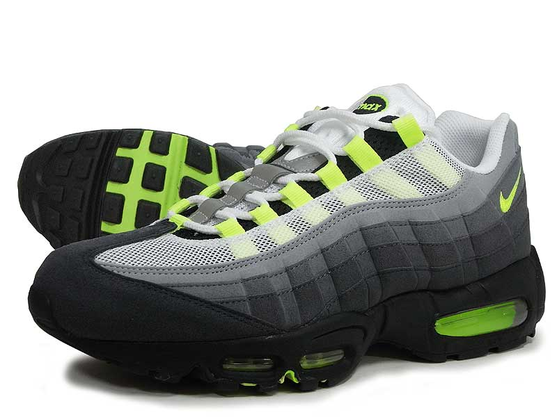

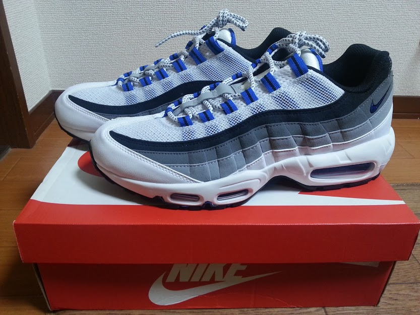

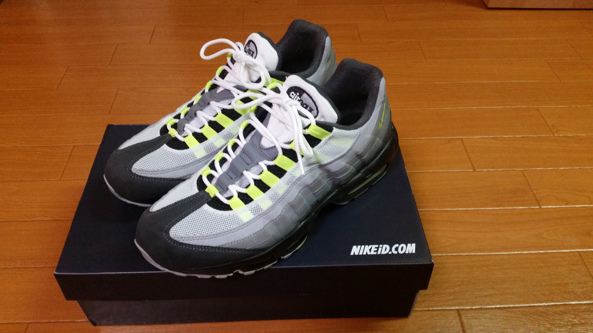

## Reebok - Insta Pump fury
ポンプを使ってフィットさせるシステムがかっこいいしハイテク！

男子女子どっちでもいけますな。

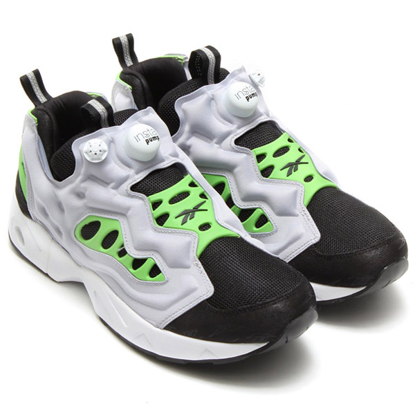

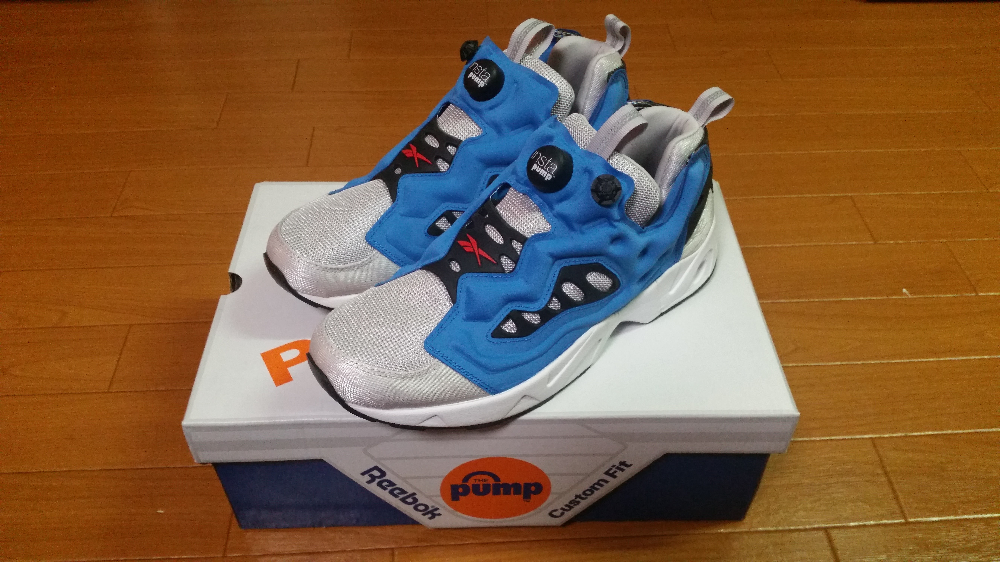

## PUMA - Disk Blaze
こちらはダイヤルを回してフィットさせる！Pump furyと並んでレース(靴紐)のないタイプのスニーカ代表作。

ほしぃ。。。

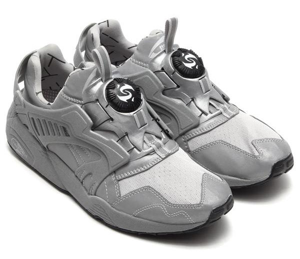

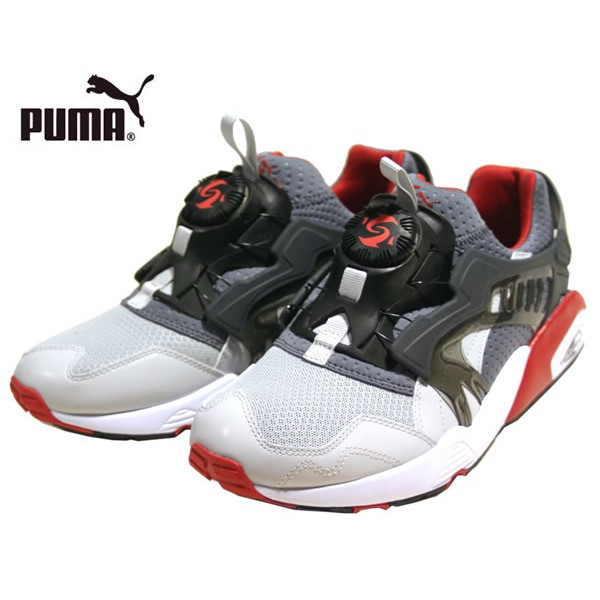

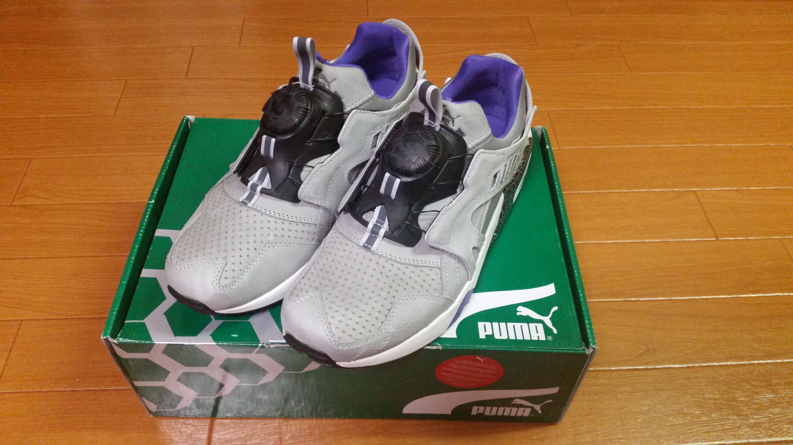

## ADIDAS - Equipment(EQT) Running Support 93
ランニングシューズの中ではトップクラスのビジュアルなんではないでしょうか。

カラーリングも落ち着いたものが多い安定感。

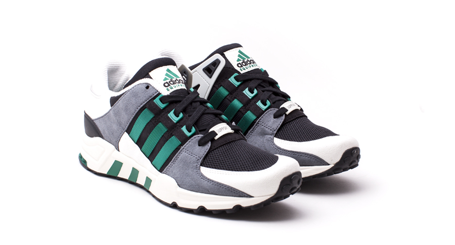

## new balance - 996
個人的には、スニーカの中で最も履きやすい。機能的にもデザイン的にも。

何足も欲しい。

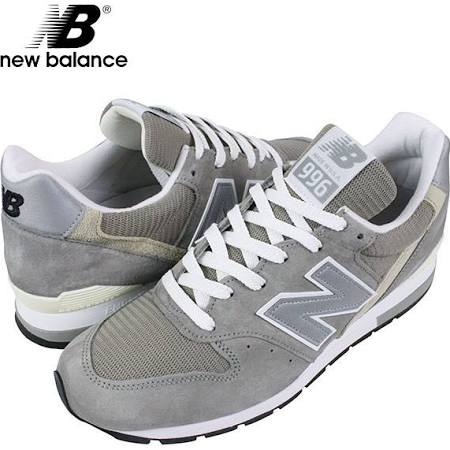

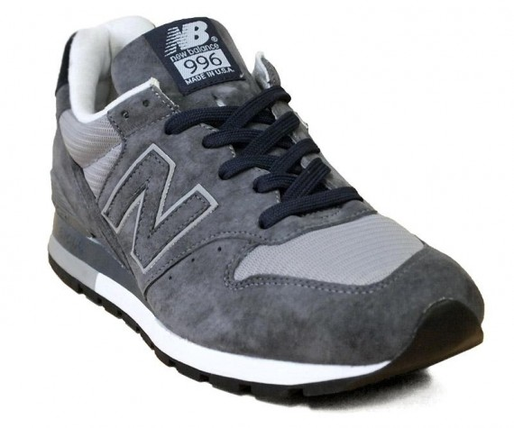

## new balance - 1300
云わずとしれた、ラルフ・ローレンが「雲の上を歩いているようだ」と絶賛した伝説の名品スニーカー。

スニーカーのロールスロイスですね。

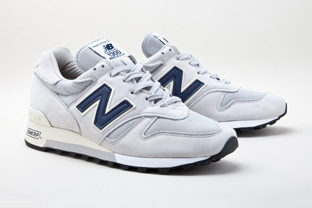

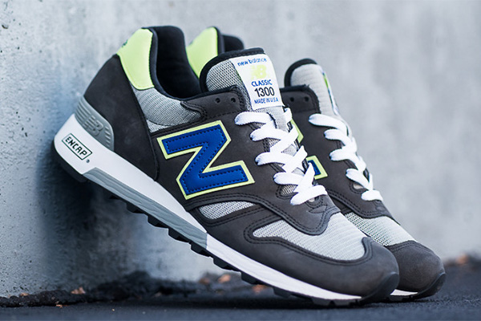

## Reebok - VENTILATOR

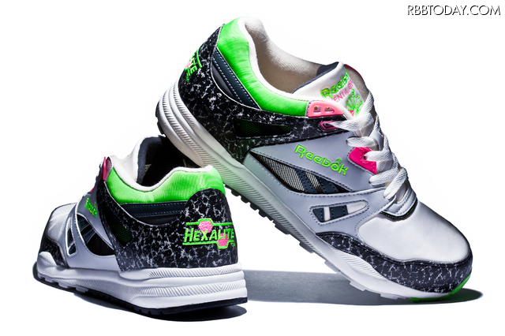

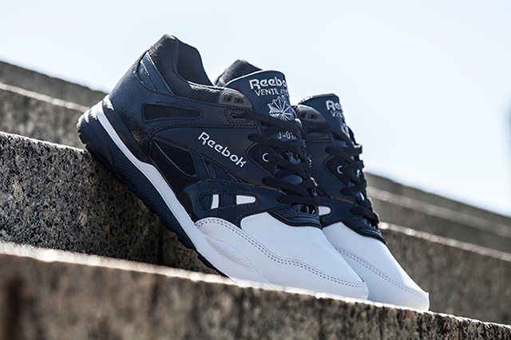

## Reebok - Pump Omni

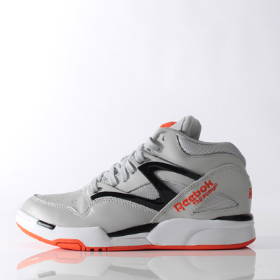

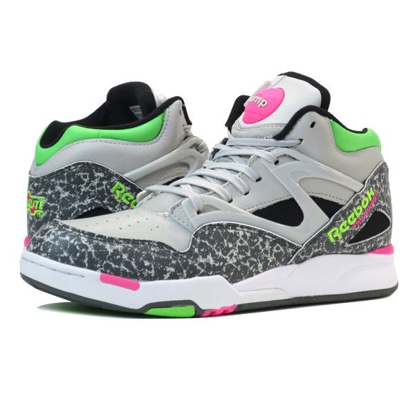

## Nike - Air Max 1
1987年に発売されたAir Max初号機。

約30年前のスニーカーが今もカッコよく、売れているってすごい。

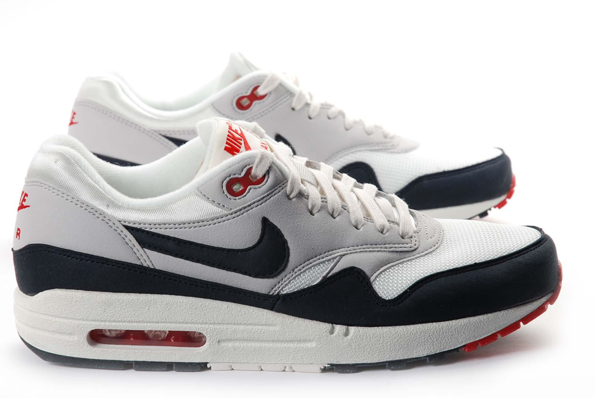

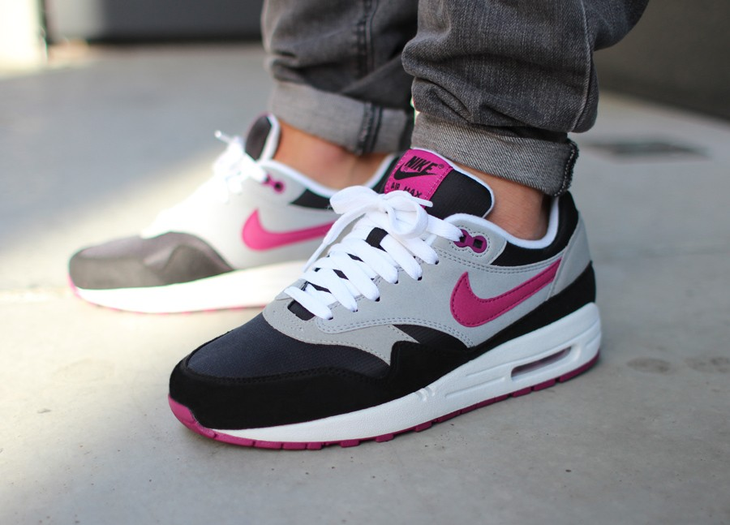

## Nike - Air Max 90
Air Maxの3作目。

ある種一つの答えだと思う。

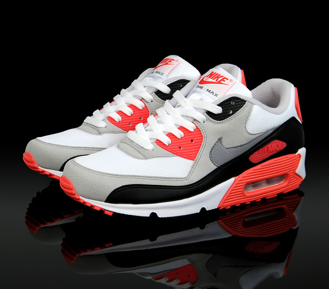

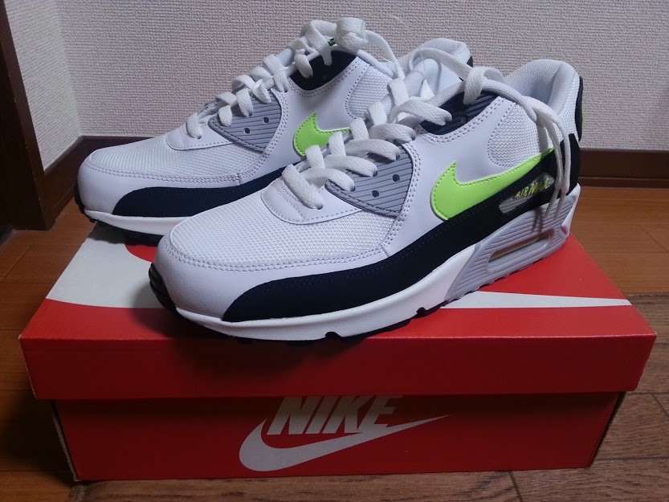

## Nike - Air Jordan 5
かのスラムダンクの流川楓が履いていたバスケットシューズ。

リアルにスラムダンク読んでいた頃は知りませんでした。

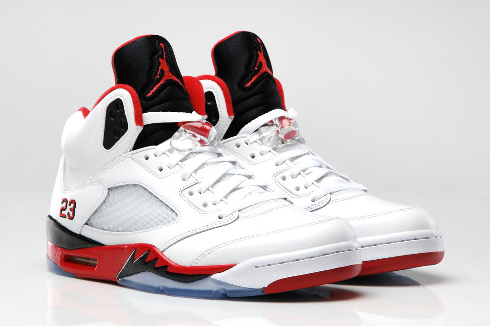

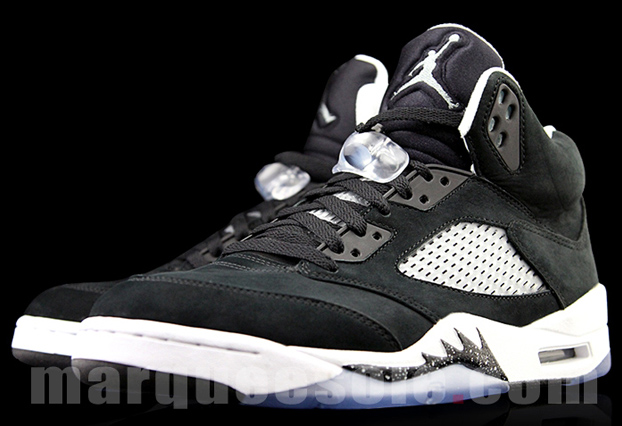
