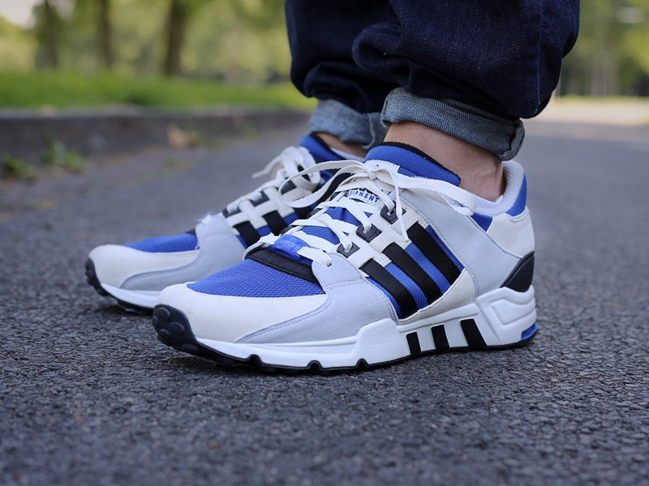

# My Sneakers
## Nike - Air Max 95
おそらくこれを超えるスニーカーはないのではないか、と思えるくらい完璧なスニーカー。

特にイエロークラデーションは最高。

## Reebok - Insta Pump fury
ポンプを使ってフィットさせるシステムがかっこいいしハイテク！

これ履いてる女子ヤバい。

## PUMA - Disk Blaze
こちらはダイヤルを回してフィットさせる！Pump furyと並んでレース(靴紐)のないタイプのスニーカ代表作。

ほしぃ。。。

## ADIDAS - Equipment(EQT) Running Support 93
ランニングシューズの中ではトップクラスのビジュアルなんではないでしょうか。

カラーリングも落ち着いたものが多い安定感。

## new balance - 996
個人的には、スニーカの中で最も履きやすい。機能的にもデザイン的にも。

何足も欲しい。

## new balance - 1300
云わずとしれた、ラルフ・ローレンが「雲の上を歩いているようだ」と絶賛した伝説の名品スニーカー。

スニーカーのロールスロイスですね。

